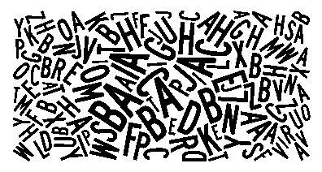

Itransition Opener — это множество задач, 4 iPhone 5s, один MacBook Pro с дисплеем Retina и 300 пригласительных на закрытую вечеринку iParty. А еще это возможность научиться чему-то новому в области CS и завести интересные знакомства в IT.

### Задача 0.
  


Я поручил решение этой задачи [duckduckgo.com](https://duckduckgo.com/?q=3^3^3) -> 7,625,597,484,987

---

### Задача 1.


Безысходность. Хотя нет. Впереди ноль, хммм двоичная система? нет. хмм восьмеричная? Спросим у [duckduckgo.com](https://duckduckgo.com/?q=02014+base+8+to+base+10) -> 1036

---

### Задача 2.


Да, это код. Первая мысль – python, так и окажется.

Постепенно расшифровываем и запускаем код.

```python
def fibonacci(x):
    if x < 0:
        raise Exception()
    digits='10'
    if x < 2:
        return digits[x]
    else:
        return '%s%s'%(fibonacci(x-1), fibonacci(x-2))
        
print(fibonacci(12))
```

Ответ: 
```
10010100100101001010010010100100101001010010010100
10100100101001001010011010010010100101001001010010
10010010100100101001010010010100101001001010001010
01001010010010100101001001010010100100101001001010
010100100101001001
```

---

### Задача 3.

Какое количество букв содержит данное изображение?



Вроде `123`. Я не гордый, я посчитал.

---

### Задача 4.

Найти 6 знаков после запятой значения площади фигуры, ограниченной осями координат и участком кривой, заданной уравнением xy(1 - xy) + x + y = 1, от точек (0, 1) до (1, 0).

Считаем интегральчик -> `0.398260`

---

### Задача 5.


Минимальное натуральное n такое, что запись 2^n в системе счисления по основанию 15 содержит все возможные цифры.

И так, нужно найти число, в десятичной системе координат, у которого будут следующие цифры: 0 1 2 3 4 5 6 7 8 9 10 11 12 13 14

Используя https://www.wolframalpha.com/ можно быстренько посчитать, что искомым значением будет 134

---

### Задача 6.


О да, открываем вики и видим... что все просто. Переводим opener_31 и opener_32 в десятичную систему. И имплементим:

```java
import java.math.BigInteger;

/**
 * Solver for http://opener.itransition.com/questions/6
 *
 * @author Ruslan Ibragimov
 */
public class RSA {

    private BigInteger keyPartOne = BigInteger.valueOf(710627287L);
    private BigInteger keyPartTwo = BigInteger.valueOf(832003547L);
    private BigInteger encrypted = BigInteger.valueOf(2014L);

    public static void main(String[] args) {
        RSA solver = new RSA();
        solver.solve();
    }

    private void solve() {
        Long threadCount = 8L;
        for (long thread = 0; thread < threadCount; thread++) {
            solveInOwnThread(thread, threadCount);
        }

    }

    private void solveInOwnThread(long threadOffset, long threadCount) {
        ((Runnable) () -> {
            for (long message = threadOffset; message <= 1_000_000_000; message+=threadCount) {
                if (encrypt(BigInteger.valueOf(message), keyPartOne, keyPartTwo).equals(encrypted)) {
                    System.out.println(message);
                    break;
                }
            }
        }).run();
    }

    private BigInteger encrypt(BigInteger message, BigInteger exponent, BigInteger module) {
        return message.modPow(exponent, module);
    }
}
```

Запускаем, и получаем заветное число: `737946857`

---

### Задача 7.

НОК периметров прямоугольников со сторонами, выражающимися натуральными числами не более 666, для которых существует полное покрытие копиями L-тримино без наложений.

Считаем НОК всех чисел до 666 * 2.

Ответ: 
```
540084540179390998411744534108225604668005667341
698406978518632839831163673855294344166352658716
586775137902320313973793819255236443368482385949
971190565808054078439281969078477707926943812036
827011429600156622045374253093340189397012974599
545429161775155148377335960944821383079679234602
353862660973546434665747667666860257688847918747
430760704237321011752803914832929208685027298225
227528018636529171688955569189762788971427553270
541250296137435850119475824774360776719367264065
343815565672185253497682791720762646904293997659
549288278374675502169085464865613737623928873410
704640000
```

---

### Задача 8.

[В файле](opener-task-8.txt) приведены пары «менеджер, подчиненный» для некой иерархической структуры. Однако данный файл не содержит пары «менеджер, подчиненный подчиненного», «менеджер, подчиненный подчиненного подчиненного» и т.д. Чему равно общее количество отношений менеджер-подчиненный, если считать действенными правила «подчиненный моего подчиненного — мой подчиненный», «подчиненный подчиненного моего подчиненного — мой подчиненный» и т.д.?

Создаем дерево, пробегаемся, считаем.

Ответ: `99611`

---

### Задача 9.

Какое количество изображений человеческих лиц содержит данный [коллаж](opener-task-9.png)?

Как настоящий линуксоид я взял ImageMagic и разбил коллаж на отдельные картинки. Т.к. лиц не сильно много, то руками можно было сосчитать, или использовать какой-нибудь Open CV.

Ах, да, вот команда.

```
convert -crop 100x100 source.png tile%d.png
```

Ответ: `738`

---

### Задача 10.


Хм. Втф. Отправляем картинку в поиск по картинкам от гугла, находим компилятор <http://www.dangermouse.net/esoteric/piet.html>, качаем, запускаем, подсовываем картинку -> OxCODE

Ответ: `49374`

---

### Задача 11.

Что вернёт вызов метода P на языке C# при передаче в него `1111111111111`?

```cs
using System;
using System.Collections.Generic;
using System.Linq;
using System.Numerics;

public class Numbers
{
    private const long one = 1L;

    private static IEnumerable<long> to(long n)
    {
        long i = one;
        while (i > 0 && i <= n)
        {
            yield return i;
            i++;
        }
    }

    public static long P(long n)
    {
        return (from y in to(n) where (from x in to(y - one) where y % x < one select one).LongCount() == one select one).LongCount();
    }
}
```

По идеологическим причинам не хочется разбираться в этом коде, полез в duckduckgo.com, а он меня послал на две буквы ([SO](http://stackoverflow.com/questions/22504994/what-should-return-p-when-transfer-1111111111111-inside)).

Ответ: `41621368073`

---

### Задача 12.

Какое значение вернёт вызов функции на языке Java `count(32767)`?

```java
private BigInteger g(BigInteger n, BigInteger g)
{
    if (g.compareTo(BigInteger.ONE) <= 0 || g.compareTo(n.subtract(BigInteger.ONE)) >= 0){
        return BigInteger.ONE;
    }
    BigInteger result = BigInteger.ONE;
    BigInteger c = BigInteger.valueOf(2);
    while (c.compareTo(g) <= 0){
        BigInteger d = n.subtract(g);
        if (c.compareTo(d) <= 0){
            result = result.add(g(d, c));
        }
        c = c.add(BigInteger.ONE);
    }
    return result;
}

public BigInteger count(int n)
{
    BigInteger v = BigInteger.valueOf(n);
    BigInteger result = BigInteger.valueOf(1 - v.abs().signum());
    BigInteger c = BigInteger.ONE;
    while (c.compareTo(v) <= 0){
        result = result.add(g(v, c));
        c = c.add(BigInteger.ONE);
    }
    return result;
}
```

Писал явно дот нетчик, поотрывал бы руки. Но да ладно.

Добавляем метод main, запускаем, получаем SOE. Ок. Вспоминаем [заповеди Martin Fowler'a](http://refactoring.com/catalog/replaceRecursionWithIteration.html) и заменяем рекурсию циклом.

Ответ:

```
19810879838067144339836422094287716632593520870
93481247692163541817609931232078619357401551232
80801088686758192610607439000269839457140659361
15684417760965334173427609015063649971477387921
378890131
```

---

### Задача 13.


Ответ: `1101022201112112220002000110001011000200`

---

### Задача 14.


Ответ: `1870629519693967053391599656186329063881723598374`

---

### Задача 15.

Чему равно максимальное значение функции F для аргументов в диапазоне от `2^29` до `2^29+63`?

```cs
#pragma warning disable
using System;using System.Linq;using System.Collections.Generic;/*#define using var*/using Ο=System.Object;using Ѣ=System.Boolean;using Τ=System.Type;using Ϯ=System.Exception;using _=System.Int32;using 〱=System.UInt32;using ǃ=System.ArgumentException;public static class X{public static int F(_ @〱)/*#define ! (int)*/{unchecked{(〱+〱._()).ǃ<ǃ>();return(!ʔ(〱&-~X.〱)?〱:X.〱)+@Ο(-~X.〱,〱>>-~X.〱).Where(_=>!ʔ(_&-~X.〱)&&@〱._(_) ).Sum();} } static@Ѣ@ǀ(Ο@Ѣ){return/*#undef !*/@Ѣ==Τ;}static@Ο@_(this@Τ@Ѣ){return@Ѣ.IsValueType&&ǀ(Ϯ(Ѣ))?Activator.CreateInstance(Ѣ):Τ;}static@Func<Τ,Τ>Ϯ=Nullable.GetUnderlyingType;static@Ѣ@ʔ( Ο@Ѣ){return@ǀ(Ѣ)||Equals(Ѣ,Ѣ.GetType()._(  ));}static@Ο@ǃ<Ѣ>(this@Ο@_)where@Ѣ:Ϯ,new (){if(ʔ(_)|| ' ' ==' ')throw new@Ѣ();return@Τ;}static@Func<_, _,IEnumerable< _>>Ο=Enumerable.Range;static@〱@_(this@_@_,string@ǃ=" "){return(〱)(ǃ[〱]==' '?0:(_+(_>>~-@ǃ[〱]))^(_>>~-@ǃ[〱]));}static@Ѣ@_(this@_@a,@_@b){〱@_=a._();〱@〱=(〱)(-~ -~X.〱);b.ǃ<ǃ>();(b%〱).ǃ<ǃ>();while(_>b._( ))_=ʔ(_%〱)?_/〱:_-b._();return@ʔ(_)||_==b._();}static@_@〱=(〱>>〱)<<〱;static@Ο@Τ=Τ;}
```

Ответ: `987599860`

---

### Задача 16.

Какая из [данных фамилий](opener-task-16.txt) наиболее отличается от каждой из остальных?

Ответ: `ZEBATINSKY`

---

### Задача 17.

Чему равна сумма цифр, записанных в [данных файлах](opener-task-17.zip)?

Вот эта задача мне понравилась. Тут не стоит считать руками. Что я сделал: Конвертнул wav в flac. Отправил на распознавание на сервера Google (google-speech-engine). В основном все распозналось, то что не распозналось можно добить руками.

Ответ: `5748`

---

### Задача 18.

Вызов данного метода на языке Ruby

```ruby
def compress(data)
  data.empty?? []:->do
    data.all?{|_|_.is_a?(Integer)&&_>=0}?->do
      size=data.max+1
      entries={}.class[[].class.new(size){|_|[[_],[_]]}]
      result=[]<<size
      sequence=[]
      data.each do |e|
        tmp=sequence+[]<<e
        if entries.has_key?(tmp)
          sequence=tmp
        else
          result+=entries[sequence]
          entries[tmp]=[]<<size
          sequence=[]<<e
          size+=1
        end
      end
      result+=entries[sequence]
    end[]:raise
  end[]
end
```

вернул массив

```
[122, 84, 104, 101, 32, 97, 110, 99, 105, 101, 110, 116, 32, 112, 104, 105, 
108, 111, 115, 111, 134, 101, 114, 115, 32, 114, 126, 107, 101, 100, 32, 99, 
111, 137, 117, 143, 125, 109, 111, 110, 103, 32, 116, 123, 32, 98, 111, 100, 
129, 144, 111, 102, 32, 119, 135, 99, 104, 173, 124, 107, 110, 111, 119, 32, 
159, 108, 121, 162, 164, 110, 97, 109, 101, 115, 46, 32, 87, 123, 110, 188, 
101, 187, 119, 142, 124, 97, 115, 148, 100, 44, 32, 102, 111, 114, 32, 101, 
120, 191, 112, 108, 101, 210, 174, 187, 115, 117, 176, 125, 165, 167, 202, 
206, 145, 149, 210, 163, 201, 125, 110, 115, 203, 114, 234, 32, 105, 132, 119, 
232, 105, 199, 118, 105, 114, 116, 117, 124, 171, 228, 113, 117, 97, 108, 245, 
202, 175, 177, 109, 97, 100, 124, 245, 125, 112, 112, 101, 97, 214, 242, 100, 
195, 89, 111, 117, 32, 109, 117, 115, 132, 98, 124, 115, 130, 115, 105, 98, 
220, 188, 97, 132, 225, 227, 126, 238, 240, 142, 151, 159, 118, 201, 144, 181,
244, 110, 212, 114, 267, 116, 105, 159, 210, 126, 150, 163, 298, 244, 246, 
282, 108, 150, 104, 97, 308, 165, 101, 130, 32, 259, 245, 205, 144, 285, 227, 
116, 111, 200, 133, 155, 112, 138, 124, 343, 306, 313, 193, 144, 105, 103, 
181, 146, 127, 101, 46]
```

Чему равна сумма чисел, переданных в данный метод?

Ответ: `33707`

---

### Задача 19.

Простые числа записаны в десятичной системе без разделителей так, что первая цифра — это 2, вторая — 3, десятая — 7 и т.д. Какая последовательность цифр записана с позиции 9876543210 по позицию 9876543219 включительно?

Ответ: `8580999214`

---

### Задача 20.

В [наборе видеофайлов](http://d309jmebo4xh7g.cloudfront.net/tasks/22/task.zip) присутствуют дубликаты с разным битрейтом, среди которых есть единственное видео, существующее ровно в трёх копиях. Вычислить произведение трёх чисел, закодированных в именах файлов этих копий в позиционной системе счисления c основанием 36.

Ответ: `8851506205792983665366672239230215502210`

---

### Задача 21.

Чему равно значение выражения `(0...2**4).map{|x| f[x[3], x[2], x[1], x[0]] * 1 << x}.inject(&:+)`, если функция `f` определена на языке Ruby таким образом, что функция `add` вычисляет сумму двух `Fixnum` по модулю 16:

```ruby
def true.*(value); value; end
def false.*(value); 0; end

class Fixnum
  def [](bit)
    self & 1 << bit != 0
  end
end

def add(a, b)
  ->(x, y, z){[->(x, y, z){f[true, z, y, x]}[x, y, z], ->(x, y){f[false, true, x, y]}[->(x, y){f[false, false, y, x]}[x, y], ->(x, y){f[false, false, y, x]}[z, ->(x, y, z){f[true, z, y, x]}[false, x, y]]]]}[a[3], b[3], ->(x, y, z){[->(x, y, z){f[true, z, y, x]}[x, y, z], ->(x, y){f[false, true, x, y]}[->(x, y){f[false, false, y, x]}[x, y], ->(x, y){f[false, false, y, x]}[z, ->(x, y, z){f[true, z, y, x]}[false, x, y]]]]}[a[2], b[2], ->(x, y, z){[->(x, y, z){f[true, z, y, x]}[x, y, z], ->(x, y){f[false, true, x, y]}[->(x, y){f[false, false, y, x]}[x, y], ->(x, y){f[false, false, y, x]}[z, ->(x, y, z){f[true, z, y, x]}[false, x, y]]]]}[a[1], b[1], ->(x, y, z){[->(x, y, z){f[true, z, y, x]}[x, y, z], ->(x, y){f[false, true, x, y]}[->(x, y){f[false, false, y, x]}[x, y], ->(x, y){f[false, false, y, x]}[z, ->(x, y, z){f[true, z, y, x]}[false, x, y]]]]}[a[0], b[0], false][1]][1]][1]][0] * 8 | ->(x, y, z){[->(x, y, z){f[true, z, y, x]}[x, y, z], ->(x, y){f[false, true, x, y]}[->(x, y){f[false, false, y, x]}[x, y], ->(x, y){f[false, false, y, x]}[z, ->(x, y, z){f[true, z, y, x]}[false, x, y]]]]}[a[2], b[2], ->(x, y, z){[->(x, y, z){f[true, z, y, x]}[x, y, z], ->(x, y){f[false, true, x, y]}[->(x, y){f[false, false, y, x]}[x, y], ->(x, y){f[false, false, y, x]}[z, ->(x, y, z){f[true, z, y, x]}[false, x, y]]]]}[a[1], b[1], ->(x, y, z){[->(x, y, z){f[true, z, y, x]}[x, y, z], ->(x, y){f[false, true, x, y]}[->(x, y){f[false, false, y, x]}[x, y], ->(x, y){f[false, false, y, x]}[z, ->(x, y, z){f[true, z, y, x]}[false, x, y]]]]}[a[0], b[0], false][1]][1]][0] * 4 | ->(x, y, z){[->(x, y, z){f[true, z, y, x]}[x, y, z], ->(x, y){f[false, true, x, y]}[->(x, y){f[false, false, y, x]}[x, y], ->(x, y){f[false, false, y, x]}[z, ->(x, y, z){f[true, z, y, x]}[false, x, y]]]]}[a[1], b[1], ->(x, y, z){[->(x, y, z){f[true, z, y, x]}[x, y, z], ->(x, y){f[false, true, x, y]}[->(x, y){f[false, false, y, x]}[x, y], ->(x, y){f[false, false, y, x]}[z, ->(x, y, z){f[true, z, y, x]}[false, x, y]]]]}[a[0], b[0], false][1]][0] * 2 | ->(x, y, z){[->(x, y, z){f[true, z, y, x]}[x, y, z], ->(x, y){f[false, true, x, y]}[->(x, y){f[false, false, y, x]}[x, y], ->(x, y){f[false, false, y, x]}[z, ->(x, y, z){f[true, z, y, x]}[false, x, y]]]]}[a[0], b[0], false][0] * 1
end
```

Ответ: `38503`

---

### Задача 22.

Пусть 1<sup>-3</sup> + 2<sup>-3</sup> + 3<sup>-3</sup> + 4<sup>-3</sup> + ... = 1.z<sub>0</sub>z<sub>1</sub>z<sub>2</sub>... в шестнадцатеричной системе счисления. Требуется найти минимальное i, такое что z<sub>i+0</sub>z<sub>i+1</sub>...z<sub>i+14</sub> является палиндромом.

Ответ: `619121109`

---

### Задача 23.

Рассмотрим все возможные лабиринты 12×9 данного формата (`#` — стена, `s` — старт, `f` — финиш, `?` — или стена, или проход):

```
############
s ?????????#
#??????????#
#??????????#
#??????????#
#??????????#
#??????????#
#????????? f
############
```

Пусть M — лабиринт данной конфигурации, для которого существует хотя бы одно решение. Обозначим длину самого короткого пути в нём через p<sub>M</sub> (за один шаг в лабиринте можно переместиться на соседнюю клетку вверх, вниз, влево или вправо). Требуется найти НОК(p<sub>M</sub>) для всех M.

Ответ: `294362129962575675`

---

### Задача 24.

Кратчайшая строка, включающая в себя данные строки в качестве подстроки:

```
CLFCTDQZTLLWQSODRSJWEUWZJXMWSRYTACMPDUOJGMLZCYBLHOCZRODZPLVGGUWZFZYGFHTDOEGGYDPJCKOMWXFOYTGPPQNJNIEEPWZXYSFQGXECULFAMTMRTVTMMQNTRBECGWOWTMJUOVTSLDHWOJGKNVKPJWRYCDQRHXSUYYDTPMPYLLBBTBKIZSWVRYDIZFEUMNKGWQUZAGWVWSCOPFCNQK
EKNTZOFOVERXLAWDTTCQYOXKMOZNWPDFEVSVESWUYIWJWVIPRUBNYMMGLMZJKZFNZMJCEHXEIHAHXDHMKGOSZXJDXLQSNXWJAWKRJETIVASDMHYISOAGCGSHKAVVQGQJCBSYECIMVSJPCLFCTDQZTLLWQSODRSJWEUWZJXMWSRYTACMPDUOJGMLZCYBLHOCZRODZPLVGGUWZFZYGFH
FQFRLEDUDJYNYIIILDTYGCRPEHIHAUPXZXQIRFKQHTOBZRIRVXNARWTKZPPKSHBTEEPWIYZOBKTMGOXLKJOQDINFAQJKUSAKRIGFSVDKJSMBPVNKIRZWVXDIXDRWQQPSRNMLNZJCIDDIMGNCQSVQVAEHAVWMIGFRJDJBQTQEBLTMSDZNCPWOUGANSCOXUJHICSTAQMABQJMXNXYBDSMETRJFDHYNIW
FVUKVFRCQKMAMCNUKDQVCXRTBMMJHOCNGPIBINYXZMUWGNKGZFEOPOJFKCKNWJHHOEQLETAMPWAYRLNXGPCPAAOXRDTLGZNDBSFVDQRPXRQAZNLMYLRSBHJMOABVBACIOUKQRXRVFRSNBUKUXVIMRTERLYOUHTQQOUFAAIATTVOWVUCUFEVEBBHAAMPIETQKXUKUTGMKWDWNSAREVW
FZRVTPMXSIPXDYACTGCMDUHFNYGXZHTEZQMWPGRPAGYDSNLXHYHTMMSEYQMCEGOZYPMPVFJDVYKBIQIMSLKFUUGSLVMRHQUPZXLIYKSGCQWHRESMWWILNDIXULALJIEZOKQZMUCSZZKHWNYHJZAFHLNMYVOBXEXZQTCLRURVHCOBZTCPOVPHNQECTDKSMQFEBKQSLFNXAGUFTFFBBKNGIWHIW
GFIFVUKVFRCQKMAMCNUKDQVCXRTBMMJHOCNGPIBINYXZMUWGNKGZFEOPOJFKCKNWJHHOEQLETAMPWAYRLNXGPCPAAOXRDTLGZNDBSFVDQRPXRQAZNLMYLRSBHJMOABVBACIOUKQRXRVFRSNBUKUXVIMRTERLYOUHTQQOUFAAIATTVOWVUCUFEVEBBHAAMPIETQKXUKUTGMKWDWNSAREVWGE
IMVSJPCLFCTDQZTLLWQSODRSJWEUWZJXMWSRYTACMPDUOJGMLZCYBLHOCZRODZPLVGGUWZFZYGFHTDOEGGYDPJCKOMWXFOYTGPPQNJNIEEPWZXYSFQGXECULFAMTMRTVTMMQNTRBECGWOWTMJUOVTSLDHWOJGKNVKPJWRYCDQRHXSUYYDTPMPYLLBBTBKIZSWVRYDIZFEUMNKGWQUZAGWVWSCOPFCNQKXDQOTAHNLOL
ITPGFIFVUKVFRCQKMAMCNUKDQVCXRTBMMJHOCNGPIBINYXZMUWGNKGZFEOPOJFKCKNWJHHOEQLETAMPWAYRLNXGPCPAAOXRDTLGZNDBSFVDQRPXRQAZNLMYLRSBHJMOABVBACIOUKQRXRVFRSNBUKUXVIMRTERLYOUHTQQOUFAAIATTVOWVUCUFEVEBBHAAMPIETQKXUKUTGMKWDWNSAREVWGEWMK
IYXPJKJUTULNJCMKLSYGVJQOEWDYCHSPXJRXFWNOVYUFJITAPNZYQTVXRUYSATKSYPMTKCSCYMKBPFHVRTCIVHNMJAMEPJPXPINPECNMMKJGPPOJGLEUXHIKOMAFBGYKUYYZNFCTEGAPVINUJMNEGVTUWEYKOCPFQFRLEDUDJYNYIIILDTYGCRPEHIHAUPXZXQIRFKQHTOBZRIR
KBONFIEKNTZOFOVERXLAWDTTCQYOXKMOZNWPDFEVSVESWUYIWJWVIPRUBNYMMGLMZJKZFNZMJCEHXEIHAHXDHMKGOSZXJDXLQSNXWJAWKRJETIVASDMHYISOAGCGSHKAVVQGQJCBSYECIMVSJPCLFCTDQZTLLWQSODRSJWEUWZJXMWSRYTACMPDUOJGMLZCYBLHOCZRODZPLVGGUWZFZYGFHTD
KKTKLQGSLGLZRNQKSMRHDFQQEBDIZHUJBBMQVLTIYIFUOUFMRUVLGVSSIIZGJOCFZYNQIGDVFCJQPBZDXCJWPAKIDCEAIBXOZYVJBORASLMYCIVKOLSZAGCMAMQMVQTFLQNFPFEEZKTDHBXZPJBWXTBUOBPSNTLRXHPIAMFCALJPIWZMMKVZPAXWABODNTILHIDCIUCJWQYUYLPAISEMYYWJXWOTKB
KQRXRVFRSNBUKUXVIMRTERLYOUHTQQOUFAAIATTVOWVUCUFEVEBBHAAMPIETQKXUKUTGMKWDWNSAREVWGEWMKYYFAUKCGUOXTGXVPILHNAWKKCCJZYTHGZMGGQBSDGETAOSTMAOLOSLLKZQOZYFBZZUGMCIYXPJKJUTULNJCMKLSYGVJQOEWDYCHSPXJRXFWNOVYUFJITAPNZYQTVXRU
LRXHPIAMFCALJPIWZMMKVZPAXWABODNTILHIDCIUCJWQYUYLPAISEMYYWJXWOTKBOMHOLUHISRKSPVCNFLGZMKUBITIOIREMLDRGPKEKAVSYESZTFNZHNWWRAZKGVHVIGMGZYHXJQUSXUTVUOCVIPJSYYYCWHEYYYGQWCIBPLQWMXEUUTEMABCENCGANXYZFYXRYKBCRHJIICUYTAKEHDIXXIJDJYSGNLKXANVDZAU
MCIYXPJKJUTULNJCMKLSYGVJQOEWDYCHSPXJRXFWNOVYUFJITAPNZYQTVXRUYSATKSYPMTKCSCYMKBPFHVRTCIVHNMJAMEPJPXPINPECNMMKJGPPOJGLEUXHIKOMAFBGYKUYYZNFCTEGAPVINUJMNEGVTUWEYKOCPFQFRLEDUDJYNYIIILDTYGCRPEHIHAUPXZXQIRFKQHTOBZRIRV
MFCALJPIWZMMKVZPAXWABODNTILHIDCIUCJWQYUYLPAISEMYYWJXWOTKBOMHOLUHISRKSPVCNFLGZMKUBITIOIREMLDRGPKEKAVSYESZTFNZHNWWRAZKGVHVIGMGZYHXJQUSXUTVUOCVIPJSYYYCWHEYYYGQWCIBPLQWMXEUUTEMABCENCGANXYZFYXRYKBCRHJIICUYTAKEHDIXXIJDJYSGNLKX
MXFZRVTPMXSIPXDYACTGCMDUHFNYGXZHTEZQMWPGRPAGYDSNLXHYHTMMSEYQMCEGOZYPMPVFJDVYKBIQIMSLKFUUGSLVMRHQUPZXLIYKSGCQWHRESMWWILNDIXULALJIEZOKQZMUCSZZKHWNYHJZAFHLNMYVOBXEXZQTCLRURVHCOBZTCPOVPHNQECTDKSMQFEBKQSLFNXAGUFTFFBBKNGIWHIWMT
NFIEKNTZOFOVERXLAWDTTCQYOXKMOZNWPDFEVSVESWUYIWJWVIPRUBNYMMGLMZJKZFNZMJCEHXEIHAHXDHMKGOSZXJDXLQSNXWJAWKRJETIVASDMHYISOAGCGSHKAVVQGQJCBSYECIMVSJPCLFCTDQZTLLWQSODRSJWEUWZJXMWSRYTACMPDUOJGMLZCYBLHOCZRODZPLVGGUWZFZYGFH
QTCLRURVHCOBZTCPOVPHNQECTDKSMQFEBKQSLFNXAGUFTFFBBKNGIWHIWMTMKOELVLWMOKNFIGCFMOHFTCDYUOYHTFKJFLTYOADKQXTSWUOINNVKBZPDKUDELFYKMCBPIJWJSJLDGAABYBTKBONFIEKNTZOFOVERXLAWDTTCQYOXKMOZNWPDFEVSVESWUYIWJWVIPRUBNYMMGLMZJKZFNZMJC
RXHPIAMFCALJPIWZMMKVZPAXWABODNTILHIDCIUCJWQYUYLPAISEMYYWJXWOTKBOMHOLUHISRKSPVCNFLGZMKUBITIOIREMLDRGPKEKAVSYESZTFNZHNWWRAZKGVHVIGMGZYHXJQUSXUTVUOCVIPJSYYYCWHEYYYGQWCIBPLQWMXEUUTEMABCENCGANXYZFYXRYKBCRHJIICUYTAKEHDIXXIJDJYSGNLKXANVD
RYCDQRHXSUYYDTPMPYLLBBTBKIZSWVRYDIZFEUMNKGWQUZAGWVWSCOPFCNQKXDQOTAHNLOLJYLKJHNYTYBHTZUXFCUIZJMAVGCWRZCIMGRMYIVWSWROWEHAQFXDRJTFRMKZTUBWHKKTKLQGSLGLZRNQKSMRHDFQQEBDIZHUJBBMQVLTIYIFUOUFMRUVLGVSSIIZGJOCFZYNQIGDVFCJ
VAEHAVWMIGFRJDJBQTQEBLTMSDZNCPWOUGANSCOXUJHICSTAQMABQJMXNXYBDSMETRJFDHYNIWRTLKZXVZYNJIVMHHTDSABWHTNKBTWWSXEBBAFHBEYDFDOERHNXYSCRMHQZAAQFXBPZDNJHKIGLWPXABFWZMXFZRVTPMXSIPXDYACTGCMDUHFNYGXZHTEZQMWPGRPAGYDSNLXHYHTMMSEYQ
VQVAEHAVWMIGFRJDJBQTQEBLTMSDZNCPWOUGANSCOXUJHICSTAQMABQJMXNXYBDSMETRJFDHYNIWRTLKZXVZYNJIVMHHTDSABWHTNKBTWWSXEBBAFHBEYDFDOERHNXYSCRMHQZAAQFXBPZDNJHKIGLWPXABFWZMXFZRVTPMXSIPXDYACTGCMDUHFNYGXZHTEZQMWPGRPAGYDSNLXHYHTMMSEYQMC
VSJPCLFCTDQZTLLWQSODRSJWEUWZJXMWSRYTACMPDUOJGMLZCYBLHOCZRODZPLVGGUWZFZYGFHTDOEGGYDPJCKOMWXFOYTGPPQNJNIEEPWZXYSFQGXECULFAMTMRTVTMMQNTRBECGWOWTMJUOVTSLDHWOJGKNVKPJWRYCDQRHXSUYYDTPMPYLLBBTBKIZSWVRYDIZFEUMNKGWQUZAGWVWSCOPFCNQKXDQO
YCWHEYYYGQWCIBPLQWMXEUUTEMABCENCGANXYZFYXRYKBCRHJIICUYTAKEHDIXXIJDJYSGNLKXANVDZAUUIQARKFVODMZXUKCZNQSEFUSHYHGZUGMUZZXRZBLDFWIXVIQVOZLDPAQRXVUCAURTPCCQQGVIJCVQGLPUBLMYRGTQLHSQJBUZAWSBXIKBNTXPYZGTCWHSKTUIQDK
```

Ответ:

```
ITPGFIFVUKVFRCQKMAMCNUKDQVCXRTBMMJHOCNGPIBINYXZMUWGNKGZFEOPOJFKCKNWJHHOEQLETAMPWAYRLNXGPCPAAOXRDTLGZNDBSFVDQRPXRQAZNLMYLRSBHJMOABVBACIOUKQRXRVFRSNBUKUXVIMRTERLYOUHTQQOUFAAIATTVOWVUCUFEVEBBHAAMPIETQKXUKUTGMKWDWNSAREVWGEWMKYYFAUKCGUOXTGXVPILHNAWKKCCJZYTHGZMGGQBSDGETAOSTMAOLOSLLKZQOZYFBZZUGMCIYXPJKJUTULNJCMKLSYGVJQOEWDYCHSPXJRXFWNOVYUFJITAPNZYQTVXRUYSATKSYPMTKCSCYMKBPFHVRTCIVHNMJAMEPJPXPINPECNMMKJGPPOJGLEUXHIKOMAFBGYKUYYZNFCTEGAPVINUJMNEGVTUWEYKOCPFQFRLEDUDJYNYIIILDTYGCRPEHIHAUPXZXQIRFKQHTOBZRIRVXNARWTKZPPKSHBTEEPWIYZOBKTMGOXLKJOQDINFAQJKUSAKRIGFSVDKJSMBPVNKIRZWVXDIXDRWQQPSRNMLNZJCIDDIMGNCQSVQVAEHAVWMIGFRJDJBQTQEBLTMSDZNCPWOUGANSCOXUJHICSTAQMABQJMXNXYBDSMETRJFDHYNIWRTLKZXVZYNJIVMHHTDSABWHTNKBTWWSXEBBAFHBEYDFDOERHNXYSCRMHQZAAQFXBPZDNJHKIGLWPXABFWZMXFZRVTPMXSIPXDYACTGCMDUHFNYGXZHTEZQMWPGRPAGYDSNLXHYHTMMSEYQMCEGOZYPMPVFJDVYKBIQIMSLKFUUGSLVMRHQUPZXLIYKSGCQWHRESMWWILNDIXULALJIEZOKQZMUCSZZKHWNYHJZAFHLNMYVOBXEXZQTCLRURVHCOBZTCPOVPHNQECTDKSMQFEBKQSLFNXAGUFTFFBBKNGIWHIWMTMKOELVLWMOKNFIGCFMOHFTCDYUOYHTFKJFLTYOADKQXTSWUOINNVKBZPDKUDELFYKMCBPIJWJSJLDGAABYBTKBONFIEKNTZOFOVERXLAWDTTCQYOXKMOZNWPDFEVSVESWUYIWJWVIPRUBNYMMGLMZJKZFNZMJCEHXEIHAHXDHMKGOSZXJDXLQSNXWJAWKRJETIVASDMHYISOAGCGSHKAVVQGQJCBSYECIMVSJPCLFCTDQZTLLWQSODRSJWEUWZJXMWSRYTACMPDUOJGMLZCYBLHOCZRODZPLVGGUWZFZYGFHTDOEGGYDPJCKOMWXFOYTGPPQNJNIEEPWZXYSFQGXECULFAMTMRTVTMMQNTRBECGWOWTMJUOVTSLDHWOJGKNVKPJWRYCDQRHXSUYYDTPMPYLLBBTBKIZSWVRYDIZFEUMNKGWQUZAGWVWSCOPFCNQKXDQOTAHNLOLJYLKJHNYTYBHTZUXFCUIZJMAVGCWRZCIMGRMYIVWSWROWEHAQFXDRJTFRMKZTUBWHKKTKLQGSLGLZRNQKSMRHDFQQEBDIZHUJBBMQVLTIYIFUOUFMRUVLGVSSIIZGJOCFZYNQIGDVFCJQPBZDXCJWPAKIDCEAIBXOZYVJBORASLMYCIVKOLSZAGCMAMQMVQTFLQNFPFEEZKTDHBXZPJBWXTBUOBPSNTLRXHPIAMFCALJPIWZMMKVZPAXWABODNTILHIDCIUCJWQYUYLPAISEMYYWJXWOTKBOMHOLUHISRKSPVCNFLGZMKUBITIOIREMLDRGPKEKAVSYESZTFNZHNWWRAZKGVHVIGMGZYHXJQUSXUTVUOCVIPJSYYYCWHEYYYGQWCIBPLQWMXEUUTEMABCENCGANXYZFYXRYKBCRHJIICUYTAKEHDIXXIJDJYSGNLKXANVDZAUUIQARKFVODMZXUKCZNQSEFUSHYHGZUGMUZZXRZBLDFWIXVIQVOZLDPAQRXVUCAURTPCCQQGVIJCVQGLPUBLMYRGTQLHSQJBUZAWSBXIKBNTXPYZGTCWHSKTUIQDK
```

---

### Задача 25.

Задана исходная строка "1", к которой могут применяться следующие базовые операции:

A) Если строка заканчивается на "1", по к ней можно дописать справа "0". Например, из "1" можно получить "10".

B) Целую строку можно удвоить. Например, из "10" можно получить "1010".

С) Любую подстроку "111" можно заменить на "0". Например, из "01111" можно получить "001" (С1) или "010" (С2) — для указания, какая именно подстрока заменяется, после буквы С указывается индекс первой (левой) единицы из тройки.

D) Любую подстроку "00" можно удалить. Например, из "00100" можно получить "100" (D0) или "001" (D3) — для указания, какая именно подстрока заменяется, после буквы D указывается индекс первого (левого) нуля из пары.

Преобразование представляет собой строку из базовых операций без разделителей. Например, преобразование "BBC0A" позволяет получить "010". Какая самая короткая строка преобразования позволяет получить "11111011110010"?

Ответ: `BBABC5BD4`

---

### Задача 26.

15 ячеек в таблице 4×4 заполнены шестнадцатеричными цифрами от 1 до F, одна ячейка пустая. За один ход можно передвинуть число в пустую ячейку из соседней. Последовательность перемещений задаётся строкой из шестнадцатеричных цифр. Например, строка `ABF` задаёт такую последовательность перемещений (из заданного начального положения):

```
1 2 3 4         1 2 3 4         1 2 3 4        1 2 3 4
5 6 7 8    A    5 6 7 8    B    5 6 7 8    F   5 6 7 8
9   A C   -->   9 A   C   -->   9 A B C   -->  9 A B C
D E B F         D E B F         D E   F        D E F
```

Требуется определить минимальную по длине последовательность шагов, которая из состояния S позволяет получить состояние D, при условии, что цифру 8 можно перемещать не более одного раза.

```
4 7 5 8         1 2 3 4
A 1 F 3         5 6 7 8
9 6 B D         9 A B C
C 2   E         D E F
  (S)             (D)
  ```

Ответ: `BDEB2C9A16D2CD2EBCEF5765764152A9DEF7642638437BC`

---

### Задача 27.

По плоскому лабиринту, ограниченному со всех сторон стеной, двигается робот. Каждая ячейка лабиринта представляет собой или пустое пространство, или часть препятствия. По [логу движения робота](opener-task-27.zip), который обошёл каждую пустую ячейку, требуется восстановить количество несвязных между собой препятсвий без учёта внешней стены.

Ответ: `58273`

---

### Задача 28.

Функция `f` на языке CoffeeScript вычисляет некоторое значение по переданному массиву целых чисел:

```
f=(x)->x[(parseInt(([][+[]]+[]+{})[!+[]+!![]+!![]+!![]..-!![]][+[]+!![]..!+[]+!![]+!![]],(!+[]+!![]<<!+[]+!![]<<!+[]+!![])+!+[]+!![]+!![])+!+[]+!![]+!![]+!![]).toString(!+[]+!![]<<!+[]+!![]<<!+[]+!![])]((_)->(($)->((_)->_(_))((_)->$(($...)->_(_)($...))))(($)->(_)->((_)->((_)->parseInt(_))(_.toString(!+[]+!![])))(!+[]+!![]<<+!![])<_&&_-((_)->((_)->parseInt(_))(_.toString(!+[]+!![])))(!+[]+!![])||$($(_+((_)->((_)->parseInt(_))(_.toString(!+[]+!![])))(!+[]+!![]+!![]))))(_+((_)->((_)->parseInt(_))(_.toString(!+[]+!![])))((!+[]+!![]<<+!![])+!![]))-((_)->((_)->parseInt(_))(_.toString(!+[]+!![])))((!+[]+!![]<<+!![])+!![])+((_)->((_)->parseInt(_))(_.toString(!+[]+!![])))(!+[]+!![]))[((!+[]+!![]+!![])*(!+[]+!![]+!![])*(!+[]+!![]+!![])).toString(+((+!![]+[])+(!+[]+!![]))*(!+[]+!![]+!![]))+([$,_]=[!+[]+!![]<<!+[]+!![]<<!+[]+!![],(((!+[]<<!+[]<<!+[]<<!+[])-!![])<<!+[]).toString(!+[]+!![]<<!+[]+!![]<<!+[]+!![])])[+!![]]+(parseInt(_,$)-!![]).toString($)+(($-!![]-!![]).toString($))+(parseInt(_,$)-!![]-!![]).toString($)+_]((_,$)->$+_)
```

Внутри реализации функции `f` используется другая функция, определённая американским учёным, не учившимся в Гарвардском университете, для изучения некоторых аспектов формальных доказательств. Какова была фамилия отца этого учёного?

Ответ: `Patrick`

---

### Задача 29.

Рассмотрим приближение n×n×n (n = 3<sup>k</sup>, где k — неотрицательное целое) губки Менгера, построеннное с учётом того, что куб со стороной 1 считается неделимым (например, приближение 9×9×9 представляет собой результат двух итераций построения губки Менгера и имеет объём 400). Обобщим данные приближения на число измерений, больше 3. Например, приближение 3×3×3×3 четырёхмерной губки Менгера представляет из себя гиперкуб, из которого удалён средний гиперкуб 1×1×1×1 и гиперкубы 1×1×1×1, имеющие общий трёхмерный куб со средним (объём такого приближения равен 72).

Требуется определить объем общей части разбиения приближения 243×243×243×243×243 пятимерной губки Менгера (0 ≤ x<sub>i</sub> < 243, 1 ≤ i ≤ 5) пятью парами гиперплоскостей (x<sub>1</sub> = 68 и x<sub>1</sub> = 165, x<sub>2</sub> = 45 и x<sub>2</sub> = 211, x<sub>3</sub> = 10 и x<sub>3</sub> = 238, x<sub>4</sub> = 14 и x<sub>4</sub> = 198, x<sub>5</sub> = 45 и x<sub>5</sub> = 212).

Ответ: `75625147430`

---

### Задача 30.

```
def _ _;(65..90)===_.ord()?_.ord()-65:_.ord()-71;end;_=DATA.read.scan(/../).map{|_|_.scan /./}.map{|__,_|v=52*_(__)+_(_)}.map{|_|_<(1<<7)?_.chr():_};puts eval's=128;d=Hash[Array.new(s){|_|[_.chr]*2}];w=r=_.shift;for k in _;if d.has_key? k;e=d[k];else;e=w+w[0];end;r+=e;d[s]=w+e[0];s+=1;w=e;end;eval("def f(x);#{r};end;f(gets)?true:false")'
__END__
COBJAlCPCTAwBaBkBmCGCEBTBmBABiBTBtCNBVBgBZAxBRBRBfBgCICCBbCdCfChBTBeAgBBAyBFAyBwBFAxByDMBABtAzBxBwBAAgBxBuAxBABFBCBtBvCVBHBwBxByAgBvAgByAsAmCLBHAtBKCTByBnBpBHCLDwDfBxCGBwDgDiAgCGDmDoDqDsAoBrApDuBnDzBrBpBpEBEDBHBtCECBBtCLBGBrBGBxCOEZEFDjCMEHDoBuBHCGBKAwBLBvAoCMAoCWAtCGEoApFCBGDsCTEWEEBrBJCGAoEMEOCTBrAiAjFQCVAiCVEPCUBrFZAgBrCVBnAnCFBxCMCACHBwENBrFhFjFlBrEOAuCIBtCKBtFpBxCKDzEzAwAtCWAwBpBnEMBtAsBuEPExBuAuAqBuBIBJEsEPBtBJBuEsBLGFBtAgBGEzBtFeDxBtBHFeBAAsAtBBEUAnBpAuCMCHBrCLAuCLCMCKCBCIBHCRBJBAAyAgBtEDAgBuBJGKGMEPCKBJAwBHGPGRGTGVAwHTHQBKAoGLGNCTHYGSGUGWCTGYGaEtGdGfGhGjEYGmBnCKAsBtEVDwBHCKHZHmAwFeAxBIBIFNHfBrAsCJGOAoCJGRCJIHEPFKCJGbGFBrHtAtFdIDBrHxGFAwGpGGBpFDIKBICRAvINENAsCHEPCQHVHXAoCHGRCHIXCTIzHRHiHkHaHnHpIbCWGeGgAtGiIDGlFeCQAsETHvCQJEIHFeAyAsEzAoIqAzApIoDxCMBJBrAnCLBxCEByAnEkAgCMAuCSFcDrIOIYGvGxCLJjILFOIwIyJAExJDAqJFHbKOKMIxHjJCJdKUFQBJCHJPIdJSIgDxIiJXJZICDxJcKSJeBnAxGpIOKNKYKRKTHnFKKeHrCWKgEzKiBHKkKsAsBAEUApFeETBHECEEDhElAuDwBJAgCPAsCAAsBvLIBJBnCPAuBvCEEcCLKjJqAuCFBtCIAgAmBGGwGyLfFOEPFSCTENAuCHCKBwArEyAwAmIqAoAyArJlApApLjCACKCVFTAnAnMXFQGJGGAuAuGDEVFWBnBrGJKvKXIzHWKQKaHnJIMnISKyJGLBKfIeLHLJJYJaIDKpKzIIMmIvMoKPKZKqKbMuNLMwMsHcKcLCGcLENBHvNDKmJbNUFeAwCQHJAsAxBpAsGHEULIAoMCFdAgFTCPDfCBDjAhFTKCNhAyBvBxBxBvBDAwBwCVBrOBAgNhAzBBBvDOBBBwBvOLBLAoBGFTCAFXBHOONhBtDdBFOSCVObCTOdOnDeLREXLSAiApOsEEHHCRAmAmCMKEAoGOBnKALkLmAsFFBMBpBJBGPJCLCLHvFGCMGJAtCMPLETPPCGBxNwIDCRLWPOAoCDHeCTPYGjAuCBCGLkCNDhBwFoFlCNCEBxGCAtGHPaBLPLBvBtCMBvCAOwBrBLBGAhBwCHBHCBHeAoBwHSJHNNGQHlNQQWQYJKAoQcJMNVBwGZJPBwIeOLIDEEKlBwKnBHKpQkFeBuGMGuPRDqKALXAgCDPaAhPLFjCKCHCPHXPiBJAoCBPLCGRLBGAqOwBxCZAlAlHLHNCHHQDwRgQpLUJzAuCAENQNAuBxDdCACTCUCJAsBxCUJtJvRSAoBxIQAsAlPHGxFTCJCVGuLxCLCRCFLOOxRRRqCTCBFFAlBKBKAsEdCBOeCRGJAlBISeBGAvPOBGCLCIEaPDPWRVEeSqRFSkMZPaSqCBLRFKFGAtEADwPqPsCEPuDTPxBwPzQBBnBMBrKHBrCBKjAhQQCNChQBKJTXCLCBCSRcHVBAAwArEMQgKOMqQiIGQeTrQZJLJGQmHqNYQpJSQrDxQtBnJYQvNeQdEsFeKWNTNPLAKdNAKhNbHxKtAyNmGFURKxNUIYUVLDLFIfUYJfNkEUPBEwBnBxIPSyPPLrCIApPBFKCWAoFNAvAvMTIdFNDwVHQiAvEMFBFPExTXAqBrJGCGJqJPEIJSCGHvCGHxEzGaBKJgMhSJAoBnBNAtBSFTVDUeMpJBMxTxMvUfUTNVMzUjNaIhHxNEQwNHKrVgKtAzIoMfAuIuVPISVSVUKbVWBrVYIeVbIDVdRAAsBnAqSKIBMfSKCSEUHATkBxIoVLLvQLCKApAqBxSPCTBEFXWvAnAtAnMSBHBvAsQYSHCQBCBARTSKAxAzAyBEAyAyAwDaXRBDBDBBDMBBAwBEXcAzBEAwBBAxBCBBBABEBpAvAlCUBFCUVHRxFaTXFdAuBrXyFZYCHODfPWAtPYRKPOAnAxBDBzCHBuCJBABvCHCMBCAnYCEyAtGNYbYeSRSTLIMCDeNuSZDfFTOLAgAqAoCQOwIzJcCBCLBrBtOZAtReAlApBLJcBrAoFTVOJZWSGRWUHnWWWYVaVcHxVgAzRCFXBGCQEqAhYtOwFTWxOfCTZiAiBHRiJDIiZJAlAkRnBzJzAsAqCEBHWfCEGuRuQLYEYJJjYCFDTXSRBnGHTYSSCFPOFdOxAkOwBzEwPLCKEhGAJtPLTjTlOwHUMOBEAxWgBKCOBEEDGaILAxVLIqBBApRlFcQPBqQSHXBnCBYCAhbGPaPbBGByCECHMGbDUtQFTECGCCOHPDJCaNNmCHKsbaBnUbIwBnWMbgLMApRTBrXsPnFXYCYEYAIuIPNMTuVvMtQWbvUSNIUhNXIcWDKjWFNdNGNfaNAxIlUeMrVzcEUWLGUmLKNlIoDfDhBvCZCUFTXMBAbZAuCNCIQIJtMbcgMdAwMfMhCVAuFTAzDZBDYGTyHiVtUAVwQXTzTvUOQlQnLDUFEzUHDgcJUMcLdJFeBBAsWMCVCHFTXWBFdAHfWRKYWTVVVXLDVZEzWaDxWcBnEzBEAsXqCVXNCUBHCYCObrFZYFMWBHCABJMCcbCVAoAnFTCObZCVXFZmRnLtVdAlCKBMBqAxBLAkCUBqJjAxArBLApBoehAkBMAhCWYOAnAqVdLSLIFceMAiAnArSlBHMaBABCCQCTAjMaCKCABvAuBufICVCKfIfDFXBuMEBAXSBBAzBFfIAvfVMEApAnFkBFBEesAxakAxAofIfKfMfOfQfSAjBKAuCKArAnezQNexSlMCMaBxfTBpAyAvIPgMBrTJMSAyMECOAoFXRqYDAjBHApIPgVDlCVBwfrfzFVBKQNTcBqNyAoEvbbQEGNAhBJeBDwJjXGFRYpCVDkRrEYBJXRBHPlAzHXBJCDBHCSBJGlCPCACBQAHLBIZrRrUzAmWXKCQSRIArBJAyEqBxCQEmNyAgAhMACTCIRrFeCDGkhhCDAqhOaaCMCNCKEIIdgpYABJVCVEVGYbKABrAqawhbGYJqZgZkDfTWZjWxZmBrgngpAhDlbbNlgmQQhoePUbYfAvAyApgvbbUbCUFZeMaIMgYdVHOZLvRaAuItBCAqGSfhVHidKdbhKjENeyfAgIfTBqPQAlIiApBwAlAsBpBuAlBuAwBnCHBvAlBvjlgWBuIcAuAzXbfTCVgJgaReCDReCJReBJBJBpAzBnApfWYAPBAzBKGzkJMEBrPBIFkQiJBJkVYCVAkECKAqkcCKLITXApCLAlArkiAlAojJZJBJkfkJJZgqAggggigAgCXFSKReAxAuAwAvAzjcAnAlBwAuAlCLlKBnBuefavFDAlAnBBGtImRBlbSdZYRBGFBuIoBHAhAhEpevLS
```

Ответ: `1FD49D4B-3CFED401-CA6941BE-3D9548F4-4CFa3CC1`

---

### Задача 31.

256 чудаков, пронумерованных по порядку от 1 до 256, стали в круг. У каждого из них есть честный шестигранный кубик и честная двусторонняя монета. Каждый из чудаков действует по следующей инструкции:

1) Подбрось кубик и запомни результат.

2) Узнай, совпадает ли результат шага 1 у двух твоих ближайших соседей. Если нет, то перейди к шагу 5.

3) Подбрось монету. Если выпал "орёл", то перейди к шагу 7.

4) Подбрось кубик ещё раз и запомни новый результат. Если твой порядковый номер нечётный, прибавь к результату 1 и запомни новое число, иначе перейди к шагу 7.

5) Если твой порядковый номер нечётный, то перейди к шагу 7.

6) Найди остаток от деления порядкового номера на 5, прибавь к нему 1 и запомни результат.

7) Последнее запомненное число является суммой твоего выигрыша.

При наблюдении за игрой стало известно, что сумма выигрыша у игроков с порядковыми номерами, являющимися простыми числами, равна увеличенному на единицу остатку от деления порядкового номера на 5.

Требуется найти НОК порядковых номеров чудаков, у которых второй знак после запятой в десятичной записи математического ожидания суммы выигрыша равен 1.

Ответ: `529882832516744261226672000`

---

### Задача 32.

Какое значение вернёт функция `f()` на языке Lua?

```lua
function f()
  return (function(...)
    p=0
    repeat
      p=p+((function(...)
        p=0
        for _ in function(p)
          while p.p>1 do
            p.p,p=(function(p,...)
                     while p%(...).p~=0 do (...).p=(...).p+1 end
                     return p/(...).p,(...).p
                   end)(p.p,{p=2})
            return p
          end
          return nil
        end, {p=...} do p=bit32.bnot(p or 0) end
        return p
      end)((...).p)==0 and 1 or -1)
      do (...).p=(...).p+1 end
    until p>=0
    return (...).p-1
  end){p=2}
end
```

Ответ: `906150257`

---

### Задача 33.

Для ЭВМ «Химка» сохранились лишь [фрагменты документации](opener-task-32.zip). Требуется определить, что будет содержать регистр `D0` ЭВМ «Химка» после выполнения данного кода, загруженного начиная с адреса 0, при условии, что разрядность устройства и объем доступной памяти достаточны для выполнения алгоритма?

```
6884, 6778, -8531, -2187, 3, 6962, -2187, 2, 7043, -2187, 2, 7124, -2187, 102, 7448, -2187, 104, 7529, 6003, 6807, -162, 6451, 8676, -2187, 100, 7205, -243, 6451, 8676, -2187, 101, 7205, 6147, 6896, 6150, 6896, -2187, 102, 7448, 7458, 6162, 6896, 6308, -2187, 102, 7448, -2187, 54, 7529, 6003, 6807, -2187, 20, 7205, 6898, 7464, -2187, 102, 7448, 5997, 6898, 7140, 6898, 7059, 6147, 6896, 6150, 6896, -2187, 102, 7448, 7458, 6162, 6896, 8493, 6392, -2187, 102, 7448, -2187, 87, 7529, 6003, 6807, -2187, 20, 7205, 6898, 7464, -2187, 102, 7448, 5997, 6898, 7140, 6898, 7059, -2187, 101, 7205, 8415, -2187, 0, 7205, 6711
```

Ответ: `5742397643169488579854258`

---

### Задача 34.

Какое значение из диапазона `long` никогда не может быть возвращено методом `Next()` класса `Sequence`?

```cs
using System;
using System.Numerics;
using System.Linq;
using System.Collections.Generic;

public static class Extensions
{
    public static byte[] GetBytes(this long value)
    {
        return BitConverter.GetBytes(value);
    }

    public static long Shuffle(this IEnumerable<byte> value)
    {
        byte[] bytes = value.ToArray();
        for (int i = 3; i < 6; i++)
        {
            int j = ((i * 65) & 322) % 15;
            var _ = bytes[i]; bytes[i] = bytes[j]; bytes[j] = _;
        }
        return BitConverter.ToInt64(bytes, 0);
    }

    private static readonly BigInteger[] constants = new String[]{
        "-197874039147647729473", "11476694254779498256719","-289093970435778669313140",
        "4151793073863561949107558", "-37510387802012243086813173", "221821149878260300916385327 ",
        "-864978456455427990279380030", "2181533168462235599461258812", "-3375575158216765638303229464",
        "2858148004005076567403906784", "-987312297795010011057381120"}.Select(s=>BigInteger.Parse(s)).ToArray();

    public static long ToConstant(this int x)
    {
        return (long)(constants.Aggregate(BigInteger.Zero, (r, c) => r * x + c) / 725760);
    }
}

public class Sequence
{
    private long current = 0;

    public long Next()
    {
        return current = (((current.GetBytes().Select(_=>(byte)((((((_&1.ToConstant())*2.ToConstant())&3.ToConstant()))+(((_&1.ToConstant())*4.ToConstant())&5.ToConstant()))*6.ToConstant()>>(int)7.ToConstant())).Shuffle()+8.ToConstant())>>(int)9.ToConstant())&(((((~(-8.ToConstant()-current.GetBytes().Select(_=>(byte)((((((_&1.ToConstant())*2.ToConstant())&3.ToConstant()))+(((_&1.ToConstant())*4.ToConstant())&5.ToConstant()))*6.ToConstant()>>(int)7.ToConstant())).Shuffle())^(current.GetBytes().Select(_=>(byte)((((((_&1.ToConstant())*2.ToConstant())&3.ToConstant()))+(((_&1.ToConstant())*4.ToConstant())&5.ToConstant()))*6.ToConstant()>>(int)7.ToConstant())).Shuffle()+8.ToConstant()))&((current.GetBytes().Select(_=>(byte)((((((_&1.ToConstant())*2.ToConstant())&3.ToConstant()))+(((_&1.ToConstant())*4.ToConstant())&5.ToConstant()))*6.ToConstant()>>(int)7.ToConstant())).Shuffle()+8.ToConstant())^1))^~(-8.ToConstant()-current.GetBytes().Select(_=>(byte)((((((_&1.ToConstant())*2.ToConstant())&3.ToConstant()))+(((_&1.ToConstant())*4.ToConstant())&5.ToConstant()))*6.ToConstant()>>(int)7.ToConstant())).Shuffle()))>>(int)9.ToConstant())&((current.GetBytes().Select(_=>(byte)((((((_&1.ToConstant())*2.ToConstant())&3.ToConstant()))+(((_&1.ToConstant())*4.ToConstant())&5.ToConstant()))*6.ToConstant()>>(int)7.ToConstant())).Shuffle()+10.ToConstant())^(current.GetBytes().Select(_=>(byte)((((((_&1.ToConstant())*2.ToConstant())&3.ToConstant()))+(((_&1.ToConstant())*4.ToConstant())&5.ToConstant()))*6.ToConstant()>>(int)7.ToConstant())).Shuffle()+11.ToConstant()))))^(((~(-8.ToConstant()-current.GetBytes().Select(_=>(byte)((((((_&1.ToConstant())*2.ToConstant())&3.ToConstant()))+(((_&1.ToConstant())*4.ToConstant())&5.ToConstant()))*6.ToConstant()>>(int)7.ToConstant())).Shuffle())^(((current.GetBytes().Select(_=>(byte)((((((_&1.ToConstant())*2.ToConstant())&3.ToConstant()))+(((_&1.ToConstant())*4.ToConstant())&5.ToConstant()))*6.ToConstant()>>(int)7.ToConstant())).Shuffle()+8.ToConstant())^1)&(~(-8.ToConstant()-current.GetBytes().Select(_=>(byte)((((((_&1.ToConstant())*2.ToConstant())&3.ToConstant()))+(((_&1.ToConstant())*4.ToConstant())&5.ToConstant()))*6.ToConstant()>>(int)7.ToConstant())).Shuffle())^(current.GetBytes().Select(_=>(byte)((((((_&1.ToConstant())*2.ToConstant())&3.ToConstant()))+(((_&1.ToConstant())*4.ToConstant())&5.ToConstant()))*6.ToConstant()>>(int)7.ToConstant())).Shuffle()+8.ToConstant()))))>>(int)9.ToConstant())&((current.GetBytes().Select(_=>(byte)((((((_&1.ToConstant())*2.ToConstant())&3.ToConstant()))+(((_&1.ToConstant())*4.ToConstant())&5.ToConstant()))*6.ToConstant()>>(int)7.ToConstant())).Shuffle()+10.ToConstant())^(current.GetBytes().Select(_=>(byte)((((((_&1.ToConstant())*2.ToConstant())&3.ToConstant()))+(((_&1.ToConstant())*4.ToConstant())&5.ToConstant()))*6.ToConstant()>>(int)7.ToConstant())).Shuffle()+11.ToConstant())))^(current.GetBytes().Select(_=>(byte)((((((_&1.ToConstant())*2.ToConstant())&3.ToConstant()))+(((_&1.ToConstant())*4.ToConstant())&5.ToConstant()))*6.ToConstant()>>(int)7.ToConstant())).Shuffle()+11.ToConstant()).GetBytes().Select(_=>(byte)((((((_&1.ToConstant())*2.ToConstant())&3.ToConstant()))+(((_&1.ToConstant())*4.ToConstant())&5.ToConstant()))*6.ToConstant()>>(int)7.ToConstant())).Shuffle();
    }
}
```

Ответ: `-5681252008236856584`

---


_Invite_

