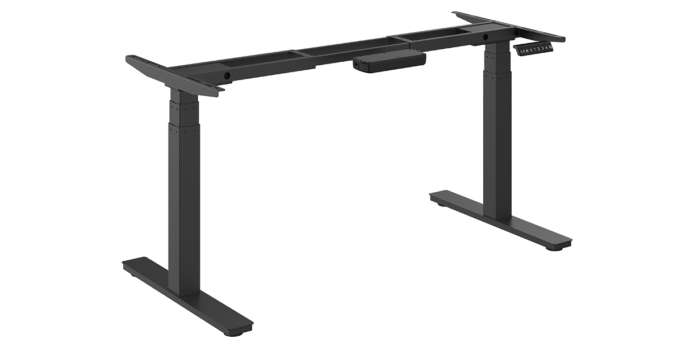
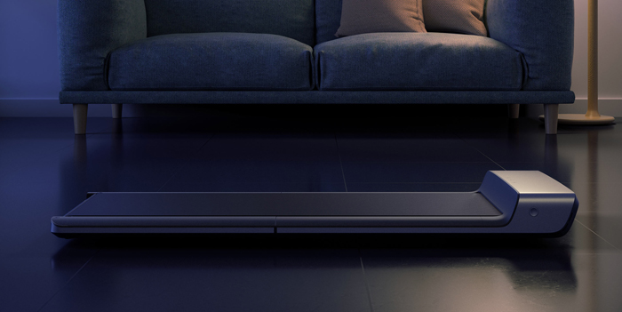
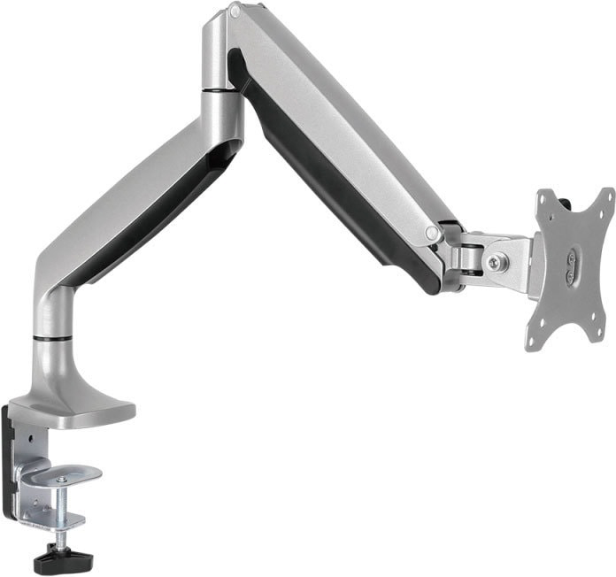

## Standing Desk

Essential part of setup. I bought just mechanism from AOKE Europe: [AK2YJRT-ZF3](https://www.aoke-europe.com/ak2yjrt-zf3)

And order chipboard in local shop.

## Walking Pad

Because we're working from home these days, my activity much lover than usually, so I decided to buy walking pad to use while working, watching or gaming.
My choice is [Xiaomi WalkingPad A1](https://www.xiaomitoday.com/walkingpad-a1-pro/) – cheap, simple, up to 6 km/h walking pad.

## Monitor Arm

Switching from chair to desk should be relativity easy, so I split desk (140 cm) in two parts - walking and standing/seating.
And, since I have only one monitor, it's not easy to move it, I decided to buy monitor arm.

My choice is Onkron G100S:

Of course, I wanted to get an [LX Desk Monitor](https://www.ergotron.com/en-us/products/product-details/45-241#?color=black&buynow=0), but they are very expensive in our market.

## Microphone Arm

[Rode PSA1](https://www.rode.com/accessories/psa1) + [AT2020USB+](https://www.audio-technica.com/en-us/at2020usb).
Not sure if I really need shock mount and pop-filter, but considering adding them in setup.

## What next

1. I use home-build PC and Macbook Pro 15 (2015), and switching between then is a pain, but I'm working on cable setup
1. Cable management
1. Ambient light for long winter nights
