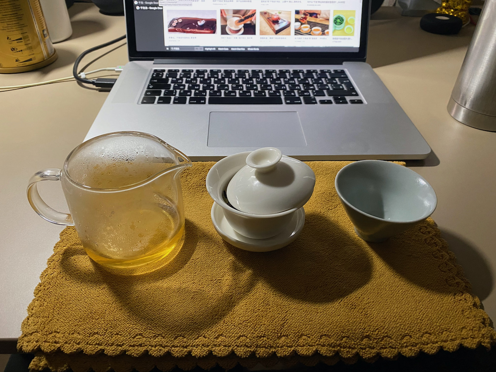

Ган пао/Цин Пао — "сухой", "чистый" способ заваривания, когда чай не проливается на чабань, а вместо чабани зачастую используется полотенце, циновка или подставка для чайника и/или пиал.

Я обычно не промываю тайваньские улуны, в отличие от пуэров и хэйчи, поэтому емкости для отработанного чая нету. Но из-за того что посуду хочется помыть/прогреть приходится все таки держать дополнительный сливник.(Кажется что именно по этой причине чабань сейчас выглядит так как мы уже привыкли)
